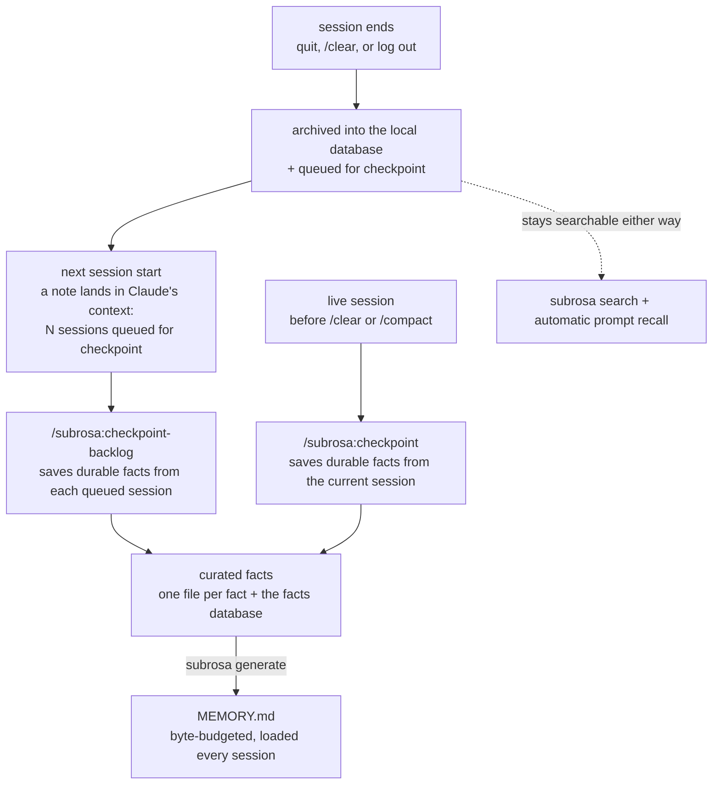

<p align="center">
  
</p>

<p align="center">
  Persistent, private memory for Claude Code — that never spends your tokens on itself.
</p>

<p align="center">
  <a href="https://github.com/ij5a/subrosa/releases/latest"></a>
  <a href="https://github.com/ij5a/subrosa/actions/workflows/ci.yml"></a>
  <a href="LICENSE"></a>
</p>

Every session is archived into a local SQLite database and becomes searchable: the work you did last month is one `subrosa search` away, relevant past sessions resurface automatically when you type a related prompt, and Claude stops rediscovering things it already figured out. That last part is where it pays for itself: pulling up last month's answer costs a few hundred tokens, while having Claude re-derive it from scratch — re-reading files, redoing the investigation — runs into the thousands.

- **No LLM calls to save memory.** Saving a session is plain text parsing — it never spends tokens. Most memory plugins run your sessions through an LLM to save them; [the comparison](docs/comparison.md) has the numbers, from their own docs.
- **Hard token limits, set in the code.** Recall adds at most ~180 tokens to a prompt, and usually nothing — it stays silent unless the match is strong. The always-loaded index is capped at 23 KB. [Check it yourself](#proof-verify-it-yourself).
- **One 3.7 MB static binary.** No daemon, no worker port, no background process. A hook fires, finishes in under 10 ms, and exits.
- **Your transcripts stay on your machine.** The binary makes zero network calls — no cloud, no telemetry — and obvious secret shapes are masked before storage. Don't take my word for it: [verify every claim yourself](#proof-verify-it-yourself).

<p align="center">
  
</p>

<p align="center">
  <a href="#why-subrosa">Why "subrosa"?</a> ·
  <a href="#quick-start">Quick start</a> ·
  <a href="#what-it-does">What it does</a> ·
  <a href="#commands">Commands</a> ·
  <a href="#the-memory-workflow">The memory workflow</a> ·
  <a href="#make-claude-search-the-archive-itself">Make Claude search the archive itself</a><br/>
  <a href="#where-your-data-lives">Where your data lives</a> ·
  <a href="#privacy-model">Privacy model</a> ·
  <a href="#proof-verify-it-yourself">Proof</a> ·
  <a href="#performance">Performance</a> ·
  <a href="#development">Development</a> ·
  <a href="docs/comparison.md">How it compares</a> ·
  <a href="docs/faq.md">FAQ</a>
</p>

## Why "subrosa"?

In ancient Rome, a rose hung over the table meant everything said under it stayed in the room — *sub rosa*, "under the rose." That's the contract this tool makes with your data: every transcript stays on your machine, in a local database, with obvious secret shapes masked before they're stored. No cloud service, no telemetry — your data never leaves your machine. What's said under the rose stays under the rose.

## Quick start

Inside Claude Code, run these two commands:

```
/plugin marketplace add ij5a/subrosa
/plugin install subrosa@subrosa
```

Then start a new Claude Code session (quit and reopen, or run `claude` again). That's the whole install:

- On that first start, the plugin downloads the right prebuilt program for your computer (about 2 MB, checksum-verified against this repo) and archives every Claude Code session already on your disk.
- From then on it runs by itself: each session is archived when it ends, related past sessions are shown to Claude when you type a prompt, and you get a short note when ended sessions are waiting to be saved into long-term memory.

The one-time download fetches the program itself — your data never goes anywhere.

Then one more command, in your terminal, for the best experience — it teaches Claude to
search the archive at the start of any task, instead of waiting for you to ask
([what it adds](#make-claude-search-the-archive-itself) — safe to run twice, ~150 tokens):

```sh
~/.claude/subrosa/bin/subrosa init --claude-md   # or just: subrosa init --claude-md, with the CLI below
```

### Optional: the `subrosa` command in your terminal

The plugin works without this. Install the CLI if you also want to search and manage the archive yourself:

```sh
# homebrew
brew install ij5a/tap/subrosa

# or the install script (prebuilt, checksum-verified)
curl -fsSL https://raw.githubusercontent.com/ij5a/subrosa/main/install.sh | sh

# or from source, if you have Rust
cargo install --git https://github.com/ij5a/subrosa
```

The plugin finds a binary on PATH and uses it, so both stay in sync. Two useful first commands:

```sh
subrosa setup    # one-time: pick where backup snapshots mirror to (iCloud / Dropbox / ... / none)
subrosa          # the dashboard
```

## What it does

- **Archives every session.** When a session ends — quitting Claude Code, running `/clear`, or logging out all count — the plugin saves its transcript into a local database (SQLite with full-text search), and catches up on anything it missed at the next start.
- **Recalls on its own.** When you submit a prompt with enough distinctive terms, the top matching past sessions from the same project are injected into context — quiet unless the match is strong.
- **Builds long-term memory.** Ended sessions wait in a queue; the bundled `/subrosa:checkpoint` and `/subrosa:checkpoint-backlog` commands read them and save the important points as curated facts (one fact per small markdown file). `subrosa generate` then builds `MEMORY.md` — a short index Claude Code loads every session, capped in size so it can never overflow.
- **Makes everything searchable.** `subrosa search <terms>` runs ranked full-text search, so identifiers like `my-app-prod` or `TICKET-123` stay searchable — with `--fuzzy` for partial names and typos.
- **Shows what clusters together.** `subrosa related <identifier>` ranks the terms and past sessions that keep showing up alongside something like `auth.ts` or `TICKET-123` — read straight from the archive, not guessed. It answers "what did this work touch" the way `search` (which finds text) can't.
- **Shows you the picture.** `subrosa` alone prints the dashboard: activity sparkline, store size, per-project share, index budget.
- **Backs itself up.** Consistent snapshots on a 24h throttle, plus an optional mirror of the latest snapshot to a folder you pick.
- **Masks secrets at the door.** Private key blocks, AWS keys, bearer tokens, and `password=`-style values are redacted before they're written.

## Commands

```sh
subrosa                                  # dashboard (same as: subrosa stats)
subrosa search aurora failover           # find that thing from three weeks ago
subrosa search --project api deploy      # scope to one project
subrosa search -n 30 --raw 'cache OR redis'
subrosa search --fuzzy ratelimiter       # substring/typo matching (builds a trigram index on first use)
subrosa related cache-prod               # terms + sessions that co-occur with an identifier
subrosa related TICKET-123 --project api # what clustered around it, scoped to one project

subrosa fact list                        # curated facts for the current project
subrosa fact upsert --leaf note.md       # add/update a fact from a markdown file (one fact per file)
subrosa generate                         # rebuild MEMORY.md (byte-budgeted)
subrosa import ~/.claude/projects/<project>/memory   # one-time import of an existing MEMORY.md

subrosa session <id>                     # dump one archived session (full id or unique prefix)
subrosa pending                          # sessions queued for checkpointing
subrosa checkpoint-drop <id>             # de-queue one session after saving it

subrosa sweep                            # catch up on changed transcripts
subrosa backup --force                   # snapshot now
subrosa setup                            # one-time backup-mirror question
```

## The memory workflow



1. A session ends (you quit Claude Code, run `/clear`, or log out) → it's archived and queued.
2. At the next session start, a note lands in Claude's context: `[subrosa] N session(s) queued for checkpoint…` — hook output goes to Claude, not to your chat window, so Claude acts on it (or you can run the next step yourself).
3. Run `/subrosa:checkpoint-backlog` — Claude reads each queued session and saves the important facts into that project's memory (one file per fact, plus the facts database), then rebuilds `MEMORY.md`.
4. Before `/clear` or `/compact`, run `/subrosa:checkpoint` to do the same for the live session.

`MEMORY.md` is generated from the facts table under a byte budget — important facts (pinned, feedback) win when space runs out, and everything that doesn't fit stays searchable in the archive.

## Make Claude search the archive itself

Recall only fires when you type a prompt. To have Claude check the archive at the
start of any task on its own, add one paragraph to your `CLAUDE.md`: `~/.claude/CLAUDE.md`
covers every project, a repo's own `CLAUDE.md` just that one. Paste and adjust:

```markdown
## Memory recall (subrosa)

Every past Claude Code session is archived locally and searchable with
`subrosa search "<keywords>"` — scope with `--project <name>`, more results with
`-n 20`, and retry with `--fuzzy` if an exact search finds nothing (partial names, typos).
(If `subrosa` isn't on PATH, it's at `~/.claude/subrosa/bin/subrosa`.)
At the start of any task — investigating, debugging, designing, reviewing, or when
a ticket, environment, resource, person, or past decision comes up — search the
archive first and build on what past sessions already worked out instead of
starting cold. Announce the search ("Searching past sessions for [topic]...") and
cite hits with their date. Skip only for trivial one-liners. `MEMORY.md` is
generated — never hand-edit it; update facts with `subrosa fact` + `subrosa generate`,
or run `/subrosa:checkpoint`.
```

Or have it appended for you — same text, idempotent, and a no-op if the section
is already there:

```sh
subrosa init --claude-md
```

subrosa never edits your `CLAUDE.md` without asking: this instruction adds about
150 tokens that load every session, so spending them is your call. In return,
Claude writes its own searches mid-task and follows leads that prompt-triggered
recall can't see.

## Where your data lives

| What | Where | Why |
|---|---|---|
| Live database | `~/.claude/subrosa/memory.db` | Not in synced folders — cloud sync corrupts a live SQLite database (its WAL/SHM helper files) |
| Snapshots | `~/.claude/subrosa/backups/` | Last 7 kept, owner-only permissions |
| Mirror | the folder you picked in `subrosa setup` | A single static snapshot file is safe to sync |
| Checkpoint queue | `~/.claude/subrosa/pending-checkpoint.log` | Plain text, one session per line |

Everything is overridable with env vars: `SUBROSA_DIR`, `SUBROSA_DB`, `SUBROSA_PROJECTS_DIR`, `SUBROSA_PENDING_LOG`, `SUBROSA_MIRROR`.

## Privacy model

- Local-only. The binary makes zero network calls; recall reads only your local database, and hook output goes only into your own session.
- Recalled snippets are your own archived text resurfaced verbatim — the injection block tells Claude to verify before relying on them.
- The database is readable only by you (`0600`), and so is its folder (`0700`).
- Secret shapes are redacted before storage. The source transcripts under `~/.claude/projects` remain as Claude Code wrote them — full-disk encryption is the real at-rest control for those.
- Two things touch the network, neither is the binary and neither carries your data out: the plugin's one-time bootstrap downloads the program from GitHub releases (checksum-verified, uploads nothing), and the optional backup mirror copies a snapshot file into a folder you pick — if you pick an iCloud/Dropbox-synced folder, your sync client uploads it. Your call, off by default.

## Proof: verify it yourself

Claims are only worth the commands that check them. Everything below runs against this repo or your own install — the whole thing is ~5,200 lines of Rust, MIT licensed, small enough to read in an afternoon.

| Claim | Check it | What you'll see |
|---|---|---|
| The token limits are constants in the code | read `MAX_INJECT` + `SNIPPET_CHARS` in `src/recall.rs`, and `DEFAULT_BUDGET` in `src/generate.rs` | `MAX_INJECT = 3`, `SNIPPET_CHARS = 160` (a match-centered snippet, hard-capped at 160 chars ≈ 180 tokens at recall), and a 23 KB index budget — values you can read, not settings that can drift |
| The binary makes zero network calls | `cargo tree -e normal \| grep -Ei 'reqwest\|hyper\|tokio\|rustls\|openssl\|curl'` | no output — there's no HTTP or networking library in the build. For runtime proof, trace it: `strace -f -e trace=network subrosa search x` (Linux) or `sudo dtruss -t connect subrosa search x` (macOS) records no `connect()` |
| Secrets are masked before storage | `cargo test redact` | the round-trip tests pass; redaction runs on the one write path (`src/ingest.rs`), so the database and its index only ever hold the masked copy |
| The archive is locked to your user | `ls -ld ~/.claude/subrosa && ls -l ~/.claude/subrosa/memory.db` | `drwx------` (0700) on the directory, `-rw-------` (0600) on the database |
| The supply chain is small and audited | `cargo tree --depth 1` · `cargo audit` | 5 direct dependencies, no known advisories. CI runs `cargo audit` on every push, and release binaries ship a `sha256sums.txt` that the installer and Homebrew formula pin |
| Nothing runs in the background | `ps aux \| grep subrosa` between prompts | nothing — every hook is a short-lived process that opens the database, does its work, and exits |

### What it does not protect

Here's what it does not protect:

- **Redaction matches known shapes — it's not a full clean-up.** It hides private-key blocks, AWS keys (starting with `AKIA` or `ASIA`), `Bearer` tokens, and labeled secrets like `password=` or `token:`. A secret that doesn't fit one of those patterns — a GitHub `ghp_…` token, an OpenAI `sk-…` key, a bare JWT — is stored as written. It cuts down obvious leaks; it doesn't remove them all.
- **Your original transcripts [stay in cleartext](https://code.claude.com/docs/en/claude-directory#plaintext-storage).** Claude Code writes them under `~/.claude/projects` and subrosa never edits those — redaction only covers its own archive copy. Full-disk encryption is the real at-rest control.
- **Recall re-injects your own stored text.** On a strong match it puts up to 3 short snippets back into the model's context, so anything that did leak into the archive can resurface there. The injection block tells Claude to treat it as unverified.
- **`0600`/`0700` is access control, not encryption** — and it's enforced on Unix only; on Windows the files fall back to default ACLs.
- **One snapshot can leave the machine, by your choice.** The optional backup mirror (`subrosa setup`, off by default) copies a snapshot to a folder you pick; aim it at an iCloud/Dropbox folder and your sync client uploads it. The live database is never synced.
- **Three small `unsafe` blocks**, all libc calls for terminal width and `SIGPIPE` (`src/stats.rs`, `src/main.rs`), each with a safety note, none in the data path. `grep -rn unsafe src/` shows all three.

## Performance

A hook that runs on every prompt has to be invisible. Measured with `scripts/bench.sh`
(hyperfine, synthetic 50,000-turn / 28 MB archive, Apple M3 Max):

| Operation | Time |
|---|---|
| Prompt recall check, no match — the usual case | ~4 ms |
| Prompt recall check, match found and injected | ~14 ms |
| A full hook fire as Claude Code runs it (shell wrapper + binary) | under 10 ms |
| Session-start catch-up sweep, nothing changed | ~5 ms |
| `subrosa search` over 50,000 turns | 5–11 ms |
| `subrosa related <identifier>` over 50,000 turns | 0.3–0.4 s |
| Archiving 50,000 turns from scratch (first install) | ~1.1 s |

One static 3.7 MB binary, no background process, no runtime dependencies — every hook
is a short-lived process that opens the database, does its work, and exits. Reproduce
the numbers with `scripts/bench.sh` (needs `hyperfine`).

## Development

```sh
mise install                          # pinned Rust toolchain (mise.lock)
git config core.hooksPath .githooks   # once per clone: sweep + fmt + clippy + tests on commit
cargo build && cargo test
```

The output formats (stored text, session dump, `MEMORY.md`, recall block) are pinned byte-for-byte by the golden tests in `tests/` — a failing golden test means a format change that needs a deliberate decision. Point everything at a throwaway dir so you never touch your live data:

```sh
SUBROSA_DIR=/tmp/x SUBROSA_PROJECTS_DIR=/tmp/x/projects cargo run -- init
```

## License

MIT
